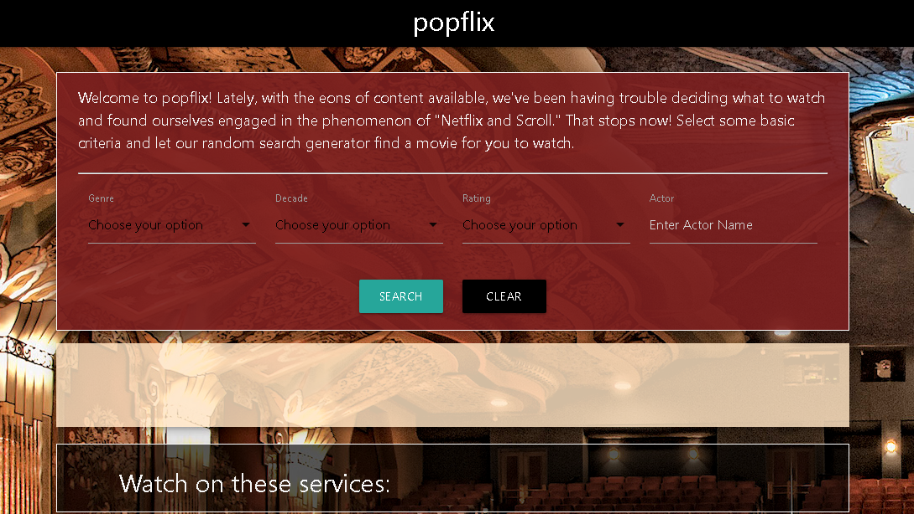

<<<<<<< HEAD
# project1-group3

Title: Popflix

A website which returns a random movie according to user-selected criteria and displays streaming options.

URL:

Files: index.html, script.js, style.css
Deployed:

Developed by:

Adam Horn, Joseph Guajardo, Skyler Blakeslee

Description:

"Welcome to popflix! Lately, with the eons of content available, we've been having trouble deciding what to watch and found ourselves engaged in the phenomenon of "Netflix and Scroll." That stops now! Select some basic criteria and let our random search generator find a movie for you to watch."

Functionality:

Users may search by Genre, Decade, Minimum Rating and Actor Name. Movie search is accomplished using IVA Entertainment Data Hub API. A random movie is selected from the search results, and it's information and poster are displayed in the body. Movie poster is obtained from Movie Database IMDB Alternative API. Streaming sources are found using Utelly API and displayed below movie information. Site utilizes materialize css framework.

Resources:

Materialize (CSS Framework)
https://materializecss.com/

IVA Entertainment Data Hub (Search movies by genre, actor, decade, rating etc.)
https://rapidapi.com/IVALLC/api/entertainment-data-hub

Utelly (Find streaming sites)
https://rapidapi.com/utelly/api/utelly

Movie Database IMDB Alternative (Obtain movie posters)
https://rapidapi.com/rapidapi/api/movie-database-imdb-alternative

=======
# Project 1

## Application Requirements

Your project should fulfill the following requirements:
* Use a CSS framework other than Bootstrap.
* Be deployed to GitHub Pages.
* Be interactive (i.e., accept and respond to user input).
* Use at least two server-side APIs.
* Does not use alerts, confirms, or prompts (use modals).
* Use client-side storage to store persistent data.
* Be responsive.
* Have a polished UI.
* Have a clean repository that meets quality coding standards (file structure, naming conventions, follows best practices for class/id naming conventions, indentation, quality comments, etc.).
* Have a quality README (with unique name, description, technologies used, screenshot, and link to deployed application).

## Presentation Requirements

* Use this project presentation template to address the following:
* Elevator pitch: a one minute description of your application
* Concept: What is your user story? What was your motivation for development?
* Process: What were the technologies used? How were tasks and roles broken down and assigned? What challenges did you encounter? What were your successes?
* Demo: Show your stuff!

Directions for Future Development

Links to the deployed application and the GitHub repository
>>>>>>> c86839c258a3c4a5b70308a658fc302fac020217
